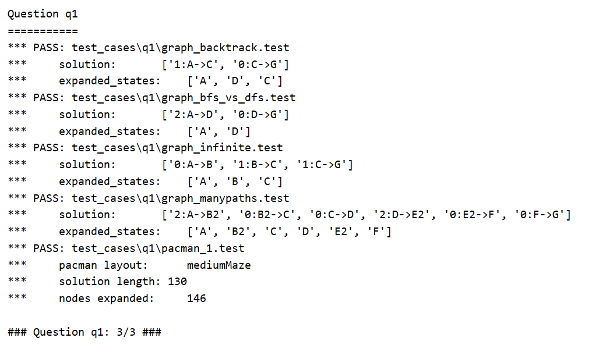
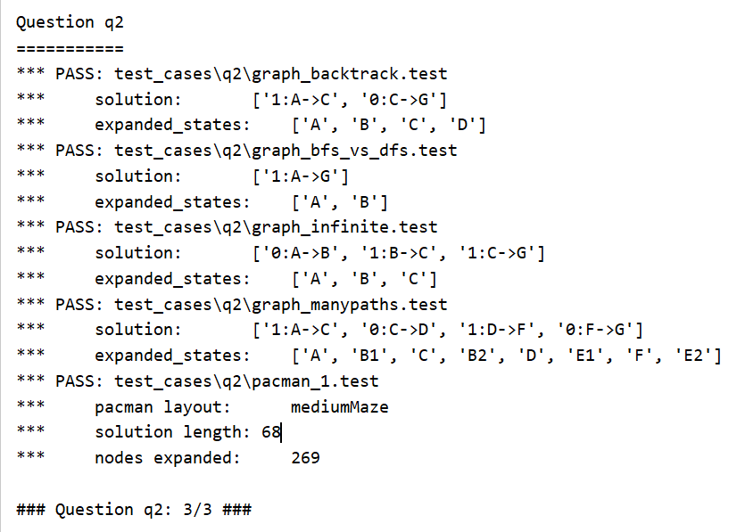
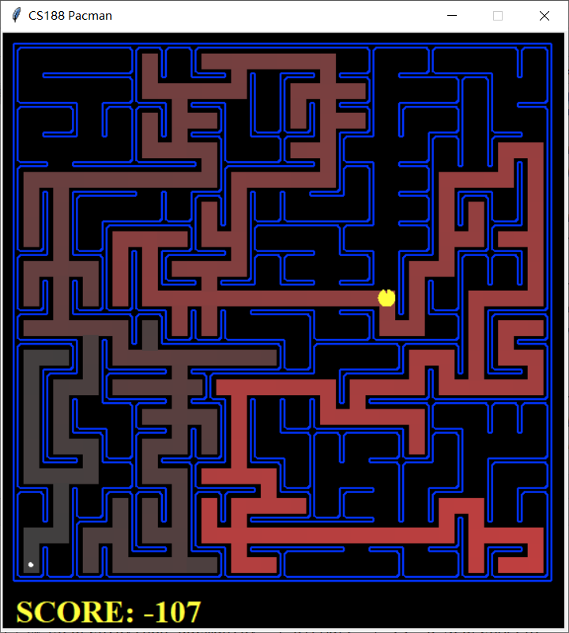
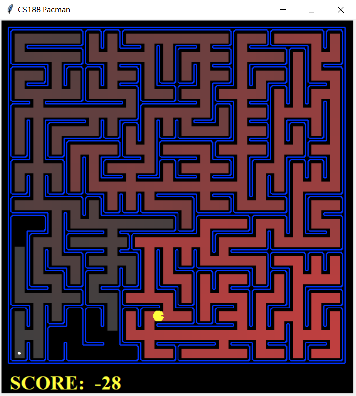
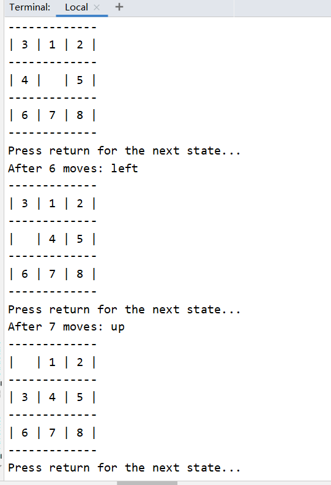

### 第一次作业

> 姓名：徐鸿飞
>
> 班级：111172
>
> 学号：20171002608

#### 实现

首先观察这两道题，要求我们通过`dfs/bfs`的搜索方式搜索到目标然后给出一条正确的路径，通过观察代码我们可以找到需要用到的一些函数，主要有：
`getStartState()`----------------------------------------获取起始点的位置
`isGoalState(state)`-----------------------------------判断当前state是否终点
`getSuccessors(state)`-------------------------------state状态下可以拓展的状态

有了这些之后我们就可以比较简单的写出初始的`dfs`代码：

```python
def depthFirstSearch(problem):
    """Search the deepest nodes in the search tree first."""
    stack1 = util.Stack() #stack1/2分别存放搜索到的状态
    stack2 = util.Stack() #和到达这个状态的路径,每次都是一起操作
    searched = set() #存放已经搜索过的状态
    stack1.push(problem.getStartState()) #首先将初始状态压栈
    stack2.push([])
    while not stack1.isEmpty(): #栈不为空的时候一直执行，栈为空还未返回就game over了，说明找不到一天路径可以到达目标状态
        state = stack1.pop() #弹出栈顶状态
        path = stack2.pop()
        if problem.isGoalState(state): #如果弹出的状态就是目标状态，直接返回路径
            return path
        searched.add(state) #如果不是，则需要先将此状态标记为已经访问过
        for new in problem.getSuccessors(state): #然后再依次将此状态的拓展状态压栈
            if new[0] not in searched and new[0] not in stack2.list:
                stack1.push(new[0])
                stack2.push(path+[new[1]]) #同时记录下路径

```

写完`dfs`之后，感觉应该是直接把stack换成queue之后就直接是`bfs`了，跑了代码之后的确可以找到路径，但是过不了`autograder`，和[吴龙永](https://github.com/chunibyo-wly)讨论了一下，是因为重复访问了，`bfs`拓展的时候应该一边拓展一边标记。即：

```python
def breadthFirstSearch(problem):
    """Search the shallowest nodes in the search tree first."""
    # 思路差不多就不写注释了。。
    queue1=util.Queue()
    queue2=util.Queue()
    searched = set()
    queue1.push(problem.getStartState())
    queue2.push([])
    searched.add(problem.getStartState())
    while not queue1.isEmpty():
        state = queue1.pop()
        path = queue2.pop()
        if problem.isGoalState(state):
            return path
        for new in problem.getSuccessors(state):
            if new[0] not in queue1.list and new[0] not in searched:
                searched.add(new[0]) #需要直接在这里标记
                queue1.push(new[0])
                queue2.push(path+[new[1]])
    return []
```

#### 结果展示

q_1:

q_2:

```bash
dfs:
python pacman.py -l bigMaze -z .5 -p SearchAgent
Path found with total cost of 210 in 0.0 seconds
Search nodes expanded: 390
```



```
bfs:
python pacman.py -l bigMaze -p SearchAgent -a fn=bfs -z .5
Path found with total cost of 210 in 0.0 seconds
Search nodes expanded: 620
```



```
python eightpuzzle.py
```



#### 改进

首先想到的就是对每个节点进行拓展的时候节点的选取，但是这样改进的话好像直接就是启发式的搜索了，像是选择拓展节点离目标节点最近的就是贪婪搜索。。。。想不出啥的改进方法了，最多只能在代码层面上对执行时间进行一些优化。。比如对每个状态的标记不使用集合来确定有没有搜索过，而是给每个状态一个flag。。

预览:https://ass.xhofe.top/ai-ass1.html