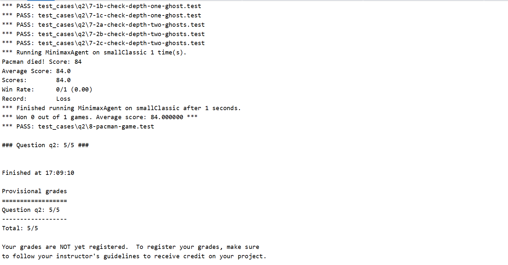
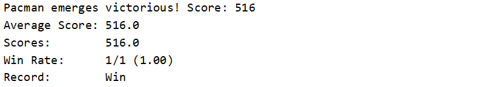
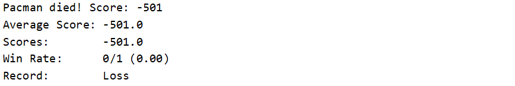

### 第三次作业

[TOC]

> 姓名：徐鸿飞
>
> 班级：111172
>
> 学号：20171002608

#### 实现

`maxmin`算法步骤：

> 1. 首先确定最大搜索深度D，D可能达到终局，也可能是一个中间格局。
> 2. 在最大深度为D的格局树叶子节点上，使用预定义的价值评价函数对叶子节点价值进行评价。
> 3. 自底向上为非叶子节点赋值。其中max节点取子节点最大值，min节点取子节点最小值。
> 4. 每次轮到我方时（此时必处在格局树的某个max节点），选择价值等于此max节点价值的那个子节点路径。

根据提示，使用递归的方法，此处`pacman`只有一个，`ghost`有很多个，每次所有agent走一次算作一层（`ps`:刚开始搞错了，吧`pacman`单独算了，所以没过测试），`pacman`每次取最大值，ghost取最小值，然后就得到：

```python
    def getAction(self, gameState):
        """
        Returns the minimax action from the current gameState using self.depth
        and self.evaluationFunction.

        Here are some method calls that might be useful when implementing minimax.

        gameState.getLegalActions(agentIndex):
        Returns a list of legal actions for an agent
        agentIndex=0 means Pacman, ghosts are >= 1

        gameState.generateSuccessor(agentIndex, action):
        Returns the successor game state after an agent takes an action

        gameState.getNumAgents():
        Returns the total number of agents in the game

        gameState.isWin():
        Returns whether or not the game state is a winning state

        gameState.isLose():
        Returns whether or not the game state is a losing state
        """
        "*** YOUR CODE HERE ***"
        # 用于递归，求解每次pacman和ghost选取的值
        def maxmin(state, depth, agentIndex):
            # ghost的数量
            numGhosts=state.getNumAgents()-1
            if state.isWin() or state.isLose() or depth == 0:
                return self.evaluationFunction(state)
            # 当前状态传入agent的合法action
            legalMoves=state.getLegalActions(agentIndex)
            # pacman 选择最大值
            if agentIndex == 0:
                # 下一层是ghost
                scores = [maxmin(state.generateSuccessor(agentIndex, action), depth, agentIndex + 1) for action in legalMoves]
                return max(scores)
            # ghost 选取最小值
            # 最后一个ghost
            if agentIndex == numGhosts:
                # 下一次是pacman
                scores = [maxmin(state.generateSuccessor(agentIndex, action), depth - 1, 0) for action in legalMoves]
                return min(scores)
            # 其他ghost 下一层还是ghost
            scores = [maxmin(state.generateSuccessor(agentIndex, action), depth, agentIndex + 1) for action in legalMoves]
            return min(scores)
        #----------------------------------------
        legalMoves = gameState.getLegalActions(0)
        # 选择最好的action
        scores = [maxmin(gameState.generateSuccessor(0,action),self.depth,1) for action in legalMoves]
        bestScore=max(scores)
        bestIndices = [index for index in range(len(scores)) if scores[index] == bestScore]
        chosenIndex = random.choice(bestIndices)  # Pick randomly among the best
        return legalMoves[chosenIndex]
```

#### 测试

```bash
python autograder.py -q q2 --no-graphics
```



```bash
python pacman.py -p MinimaxAgent -l minimaxClassic -a depth=4
```



```bash
python pacman.py -p MinimaxAgent -l trappedClassic -a depth=3
(此处无法避免)
```



#### 收获

1. 这种现实中的问题很难构造完整的格局树，只能确定一定深度内的最佳选择；一般来说（对手总是能做出最佳选择），深度越大效果越好；
2. `minimax`算法求出的解并不是最优解，因为总是考虑最坏的情况而对手并不是总会做出最佳选择。

[预览](https://ass.xhofe.top/ai-ass3.html)