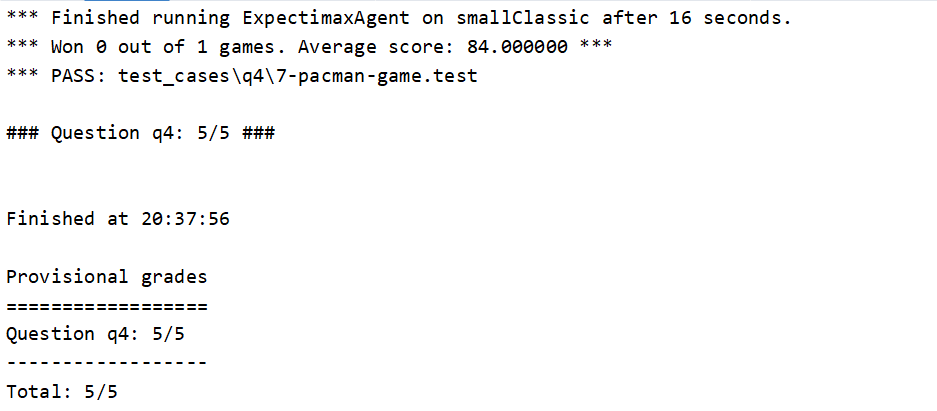
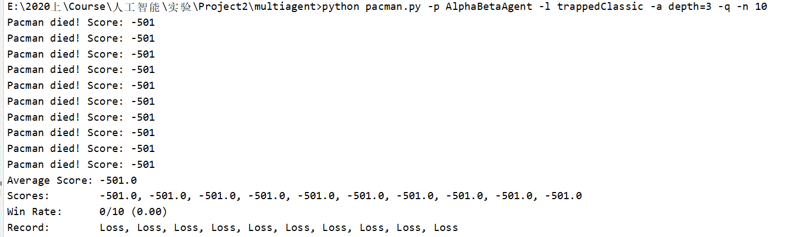
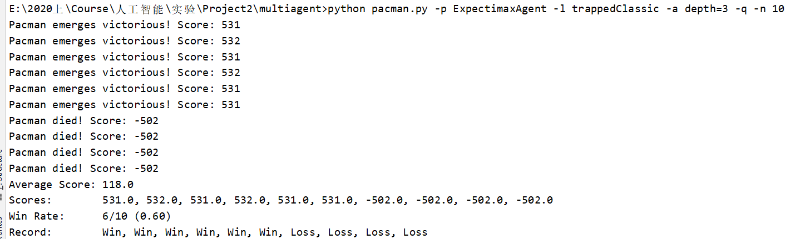
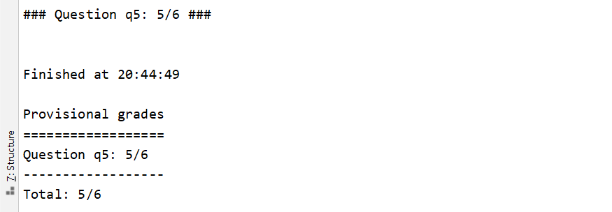

### 第五次作业

[TOC]

> 姓名：徐鸿飞
>
> 班级：111172
>
> 学号：20171002608

#### 实现

##### Expectimax

其实就是把ghost的选择由选择最小值改为了期望值

```python
    def getAction(self, gameState):
        """
        Returns the expectimax action using self.depth and self.evaluationFunction

        All ghosts should be modeled as choosing uniformly at random from their
        legal moves.
        """
        "*** YOUR CODE HERE ***"

        def maxmin(state, depth, agentIndex):
            # ghost的数量
            numGhosts = state.getNumAgents() - 1
            if state.isWin() or state.isLose() or depth == 0:
                return self.evaluationFunction(state)
            # 当前状态传入agent的合法action
            legalMoves = state.getLegalActions(agentIndex)
            # pacman 选择最大值
            if agentIndex == 0:
                # 下一层是ghost
                scores = [maxmin(state.generateSuccessor(agentIndex, action), depth, agentIndex + 1) for action in legalMoves]
                return max(scores)
            # ghost 选取期望值
            # 最后一个ghost
            numActions=len(legalMoves)
            if agentIndex == numGhosts:
                # 下一次是pacman
                scores = [maxmin(state.generateSuccessor(agentIndex, action), depth - 1, 0) for action in legalMoves]
            # 其他ghost 下一层还是ghost
            else:
                scores = [maxmin(state.generateSuccessor(agentIndex, action), depth, agentIndex + 1) for action in legalMoves]
            return sum(scores)/numActions
        # ----------------------------------------
        legalMoves = gameState.getLegalActions(0)
        # 选择最好的action
        scores = [maxmin(gameState.generateSuccessor(0, action), self.depth, 1) for action in legalMoves]
        bestScore = max(scores)
        bestIndices = [index for index in range(len(scores)) if scores[index] == bestScore]
        chosenIndex = random.choice(bestIndices)  # Pick randomly among the best
        return legalMoves[chosenIndex]
```


##### 更好的评估函数

评估函数主要考虑的几点：

1. 当前状态已经分出胜负，直接返回最大/最小值；
2. 初始化初始分数为`currentGameState.getScore()`；
3. 考虑离食物的距离，这里我考虑离`pacman`最近的三个食物的距离分布乘以1/2/3，如果食物可以吃掉，则优先吃掉食物；
4. 考虑要远离ghost，我只考虑距离3以内的ghost的距离乘以2；
5. 同时考虑吃掉capsule。

尝试过以后，发现很容易在某个地方陷入循环。。然后我修改了考虑食物，只考虑最近的食物，权重改为1.5.虽然有时还是循环，但有所改观

```python
    # 首先判断当前是否已经结束
    if currentGameState.isWin():
        return float('inf')
    if currentGameState.isLose():
        return -float('inf')
    score = currentGameState.getScore()
    # 考虑food
    foods = currentGameState.getFood().asList()
    foodDis=[util.manhattanDistance(currentGameState.getPacmanPosition(),food) for food in foods]
    foodDis.sort(reverse=True)
    numFoods = 3
    if currentGameState.getNumFood()<3:
        numFoods=currentGameState.getNumFood()
    score-=foodDis[0]*1.5
    # for i in range(numFoods):
    #     score-=(numFoods-i)*foodDis[i]
    # 如果附近有food 最好可以吃到
    score-=(currentGameState.getNumFood()*4)
    # 考虑ghost
    ghostDis=[util.manhattanDistance(currentGameState.getPacmanPosition(),ghost) for ghost in currentGameState.getGhostPositions()]
    score+=max(3,min(ghostDis))*2
    # 考虑capsule
    score-=len(currentGameState.getCapsules())*4
    return score
```


#### 测试

##### Expectimax

```bash
python autograder.py -q q4
```



```bash
python pacman.py -p AlphaBetaAgent -l trappedClassic -a depth=3 -q -n 10
```



```bash
python pacman.py -p ExpectimaxAgent -l trappedClassic -a depth=3 -q -n 10
```



##### 更好的评估函数

```bash
python autograder.py -q q5 --no-graphics
```



#### 总结

1. 因为ghost不是智能的，将minimax中的min改为期望之后可以提高获胜概率；
2. 评估函数的设计没有考虑到wall，所以还是不是特别好。。。大致考虑的都差不多，主要是调参。

本文链接：<https://ass.xhofe.top/ai-ass5.html>