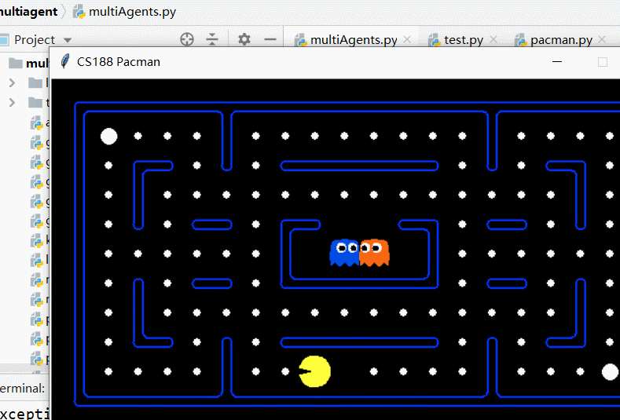
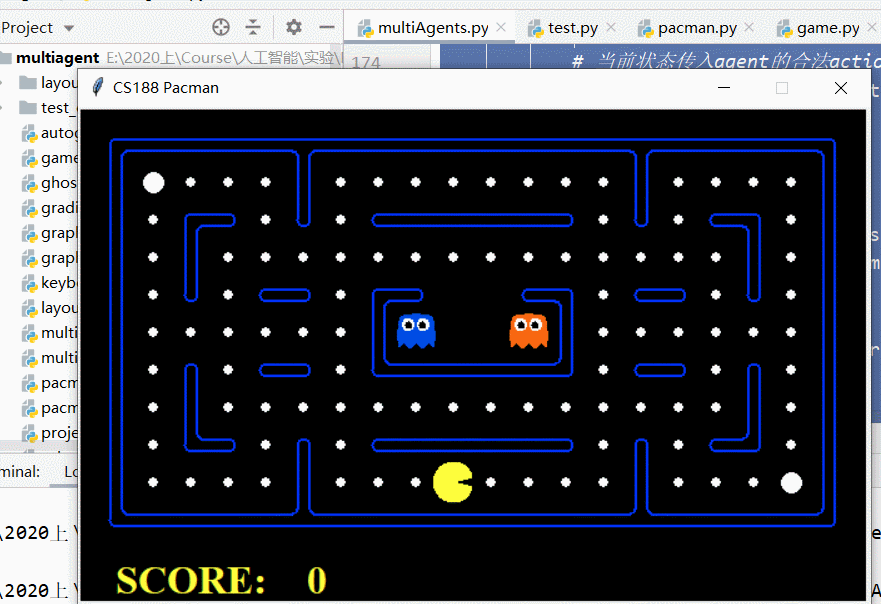
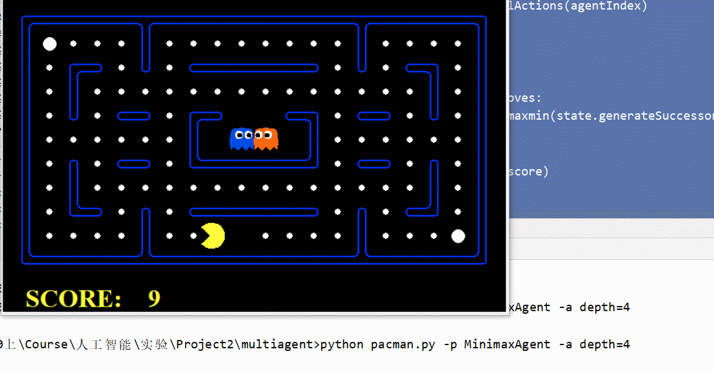

### 第四次作业

[TOC]

> 姓名：徐鸿飞
>
> 班级：111172
>
> 学号：20171002608

#### 实现

`minimax`算法步骤：

> 1. 首先确定最大搜索深度D，D可能达到终局，也可能是一个中间格局。
> 2. 在最大深度为D的格局树叶子节点上，使用预定义的价值评价函数对叶子节点价值进行评价。
> 3. 自底向上为非叶子节点赋值。其中max节点取子节点最大值，min节点取子节点最小值。
> 4. 每次轮到我方时（此时必处在格局树的某个max节点），选择价值等于此max节点价值的那个子节点路径。

α-β剪枝就是在`minimax`的基础上去除无用的支树/节点。具体即：在每次遍历action的时候，ghost取最小值如果已经找到了比α小的值，则直接取这个值，不再往下遍历，每次更新β为当前max(score,β)；pacman取最大值如果已经找到了比β大的值，则直接取这个值，不再往下遍历，每次更新α为当前min(score,α)。

```python
def getAction(self, gameState):
    """
    Returns the minimax action using self.depth and self.evaluationFunction
    """
    "*** YOUR CODE HERE ***"
    def maxmin(state, depth, agentIndex, alpha, beta):
        # ghost的数量
        numGhosts = state.getNumAgents() - 1
        if state.isWin() or state.isLose() or depth == 0:
            return self.evaluationFunction(state)
        # 当前状态传入agent的合法action
        legalMoves = state.getLegalActions(agentIndex)
        # pacman 选择最大值
        if agentIndex == 0:
            # 下一层是ghost
            score = -float('inf')
            for action in legalMoves:
                score = max(score,
                            maxmin(state.generateSuccessor(agentIndex, action), depth, agentIndex + 1, alpha, beta))
                if score > beta:
                    return score
                alpha = max(alpha, score)
            return score
        # ghost 选取最小值
        # 最后一个ghost
        score = float('inf')
        if agentIndex == numGhosts:
            # 下一次是pacman
            for action in legalMoves:
                score = min(score, maxmin(state.generateSuccessor(agentIndex, action), depth - 1, 0, alpha, beta))
                if score < alpha:
                    return score
                beta = min(beta, score)
            return score
        # 其他ghost 下一层还是ghost
        for action in legalMoves:
            score = min(score, maxmin(state.generateSuccessor(agentIndex, action), depth, agentIndex + 1, alpha, beta))
            if score < alpha:
                return score
            beta = min(beta, score)
        return score

    # ------------------------------------------------------------
    legalMoves = gameState.getLegalActions(0)
    score = -float('inf')
    alpha = -float('inf')
    beta = float('inf')
    # 选择最好的action
    bestMove = Directions.STOP
    for action in legalMoves:
        new_score = max(score, maxmin(gameState.generateSuccessor(0, action), self.depth, 1, score, beta))
        if score < new_score:
            score = new_score
            bestMove = action
        # if score>=beta:
        #     return bestMove
        # alpha=max(alpha,score)
    return bestMove
```

#### 测试

```bash
python autograder.py -q q3 --no-graphics
```


#### 对比

```bash
python pacman.py -p MinimaxAgent -a depth=3
```



```bash
python pacman.py -p AlphaBetaAgent -a depth=3
```


在默认layout，depth为3时可以明显的看到经过α-β剪枝，速度有了明显的提升。

```bash
python pacman.py -p MinimaxAgent -a depth=4
```



```bash
python pacman.py -p AlphaBetaAgent -a depth=4
```



可以看到depth=4时，提升更为明显。

在尝试depth=5时，Minimax直接无法工作了，而α-β还可以以较慢的速度执行。

#### 收获

1. α-β剪枝在工作时，比较看重节点的顺序，节点的顺序，影响剪枝的效果：min节点从小到大排序，剪枝更多；max节点从大到小排序，剪枝更好。
2. 深度越深时，α-β的改进越明显。

