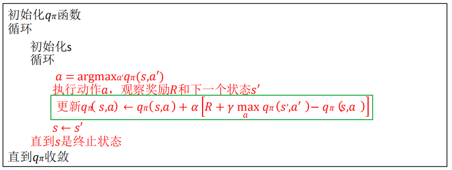
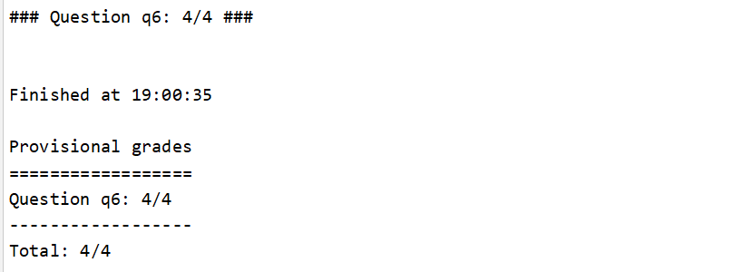
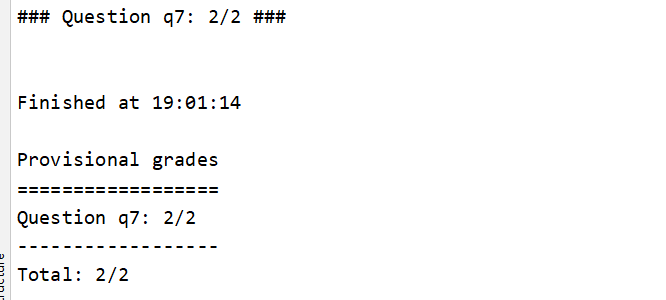

### 第三次作业

[TOC]

> 姓名：徐鸿飞	班级：111172	学号：20171002608
>

#### Code

##### Question 6 (4 points): Q-Learning

Q学习主要是维护一个Q表格，通过表格选择最佳动作，在不断的尝试中更新优化Q表格。更新公式：
$$
Q(S,A) \leftarrow (1-\alpha)Q(S,A) + \alpha[R(S, a) + \gamma\max\limits_aQ(S', a)]
$$
即`ppt`中的：



我们要实现的一些函数：

> `update`：即公式的更新计算;
>
> `computeValueFromQValues`：即$\max\limits_aQ(S', a)$;
>
> `getQValue`：访问Q表格；
>
> `computeActionFromQValues`：由Q表格得到最好的action,(随机选择一个q值最大的action)

code:

```python
def update(self, state, action, nextState, reward):
    """
      The parent class calls this to observe a
      state = action => nextState and reward transition.
      You should do your Q-Value update here

      NOTE: You should never call this function,
      it will be called on your behalf
    """
    "*** YOUR CODE HERE ***"
    self.qValues[(state, action)] = ((1 - self.alpha) * self.getQValue(state, action)) + self.alpha * (reward + self.discount * self.computeValueFromQValues(nextState))

def computeValueFromQValues(self, state):
    """
      Returns max_action Q(state,action)
      where the max is over legal actions.  Note that if
      there are no legal actions, which is the case at the
      terminal state, you should return a value of 0.0.
    """
    "*** YOUR CODE HERE ***"
    if len(self.getLegalActions(state)) == 0:
        return 0.0
    max_value = -float('inf')
    for action in self.getLegalActions(state):
        max_value = max(max_value, self.getQValue(state, action))
    return max_value

def getQValue(self, state, action):
    """
      Returns Q(state,action)
      Should return 0.0 if we have never seen a state
      or the Q node value otherwise
    """
    "*** YOUR CODE HERE ***"
    return self.qValues[(state, action)]

def computeActionFromQValues(self, state):
    """
      Compute the best action to take in a state.  Note that if there
      are no legal actions, which is the case at the terminal state,
      you should return None.
    """
    "*** YOUR CODE HERE ***"
    legal_actions = self.getLegalActions(state)
    if len(legal_actions) == 0: return None
    values = [self.getQValue(state, action) for action in legal_actions]
    max_value = max(values)
    best_indices = [index for index in range(len(values)) if values[index] == max_value]
    return legal_actions[random.choice(best_indices)]
```

##### Question 7 (2 points): Epsilon Greedy

看介绍，就是实现一个概率性随机action而不是按照Q表格的策略选择action的函数：

```python
def getAction(self, state):
    """
      Compute the action to take in the current state.  With
      probability self.epsilon, we should take a random action and
      take the best policy action otherwise.  Note that if there are
      no legal actions, which is the case at the terminal state, you
      should choose None as the action.

      HINT: You might want to use util.flipCoin(prob)
      HINT: To pick randomly from a list, use random.choice(list)
    """
    # Pick Action
    legalActions = self.getLegalActions(state)
    action = None
    "*** YOUR CODE HERE ***"
    # util.raiseNotDefined()
    if random.random() < self.epsilon:
        action = random.choice(legalActions)
    else:
        action = self.getPolicy(state)
    return action
```

#### Auto grader

```bash
python autograder.py -q q6
```



```bash
python autograder.py -q q7
```



#### Summary

Q学习是一个真正的在不断试错的过程，通过不断的尝试，逐渐的修正选择。

参考：[如何用简单例子讲解 Q - learning 的具体过程？ - 牛阿的回答 - 知乎](https://www.zhihu.com/question/26408259/answer/123230350) 很形象，还有可视化的[小游戏](https://enhuiz.github.io/flappybird-ql/)。
