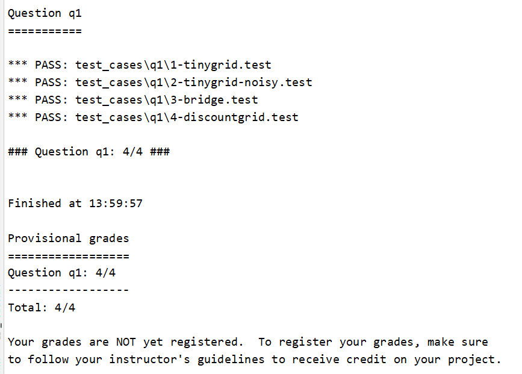
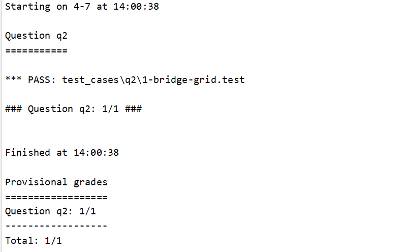
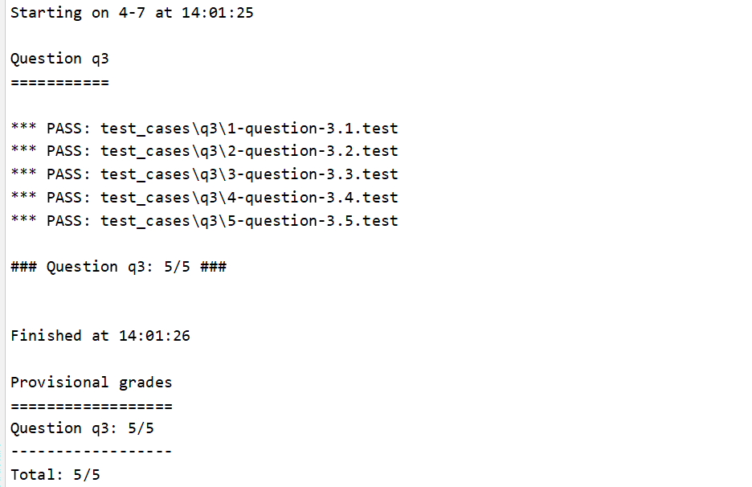

### 第三次作业

[TOC]

> 姓名：徐鸿飞	班级：111172	学号：20171002608
>

#### Code

##### Question 1 (4 points): Value Iteration

第一问要实现价值迭代，根据公式：
$$
V_{k+1}(s)<-\mathop{max}\limits_a\sum_{s^{'}}T(s,a,s^{'})[R(s,a,s^{'})+{\gamma}V_k(S^{'})]
$$
首先要知道要用到的函数：

> 获取所有的state(每个state可以看成格子世界中的一个格子的状态)
>
> `mdp.getStates()`
>
> 对于传入state给出可能的action
>
> `mdp.getPossibleActions(state)`
>
> 对与传入的state与action给出所有的(下一步state,到达这个state的概率{$T(s,a,s^{'})$})因为有noise 的影响
>
> `mdp.getTransitionStatesAndProbs(state, action)`
>
> 获取传入state,action,下一state的回报{$R(s,a,s^{'})$}
>
> `mdp.getReward(state, action, nextState)`

在`computeQValueFromValues(self, state, action)`中计算state状态下选择此action的`qValue`，然后在`runValueIteration()`中进行迭代，对于每个state（格子），选择最大的`qValue`，然后更新每个state的value，在这里不能直接修改类中的value，而是遍历完所有的state之后再修改，因为一次迭代中，使用的上一次的state不能被改变；最后就是`computeActionFromValues(self, state)`,通过计算当前传入state的每个action对应的`qValue`，选择`qValue`最大的action。Code：

```python
    def runValueIteration(self):
        # Write value iteration code here
        "*** YOUR CODE HERE ***"
        i=0
        while i<self.iterations:
            temp_values = util.Counter()  # 每次迭代都要用上一次的值
            for state in self.mdp.getStates():
                max_value=-float('inf')
                for action in self.mdp.getPossibleActions(state):
                    v=self.computeQValueFromValues(state,action)
                    max_value=max(max_value,v)
                    temp_values[state]=max_value
            self.values = temp_values
            i+=1

    def computeQValueFromValues(self, state, action):
        """
          Compute the Q-value of action in state from the
          value function stored in self.values.
        """
        "*** YOUR CODE HERE ***"
        q_val=0
        for t_state,t_prob in self.mdp.getTransitionStatesAndProbs(state,action):
            reward=self.mdp.getReward(state,action,t_state)
            q_val+=t_prob*(reward+self.discount*self.getValue(t_state))
        return q_val
        util.raiseNotDefined()

    def computeActionFromValues(self, state):
        """
          The policy is the best action in the given state
          according to the values currently stored in self.values.

          You may break ties any way you see fit.  Note that if
          there are no legal actions, which is the case at the
          terminal state, you should return None.
        """
        "*** YOUR CODE HERE ***"
        m_action = None
        if self.mdp.isTerminal(state):
            return m_action
        max_value = -float('inf')
        for action in self.mdp.getPossibleActions(state):
            v = self.computeQValueFromValues(state,action)
            if max_value < v:
                max_value = v
                m_action = action
        return m_action
        util.raiseNotDefined()
```

##### Question 2 (1 point): Bridge Crossing Analysis

第二问主要是调参，在给出的地图中，不能走两边的低分，所以只需要不能有noise即可，这里设置noise为0，discount不变为0.9。code：

```python
def question2():
    answerDiscount = 0.9
    answerNoise = 0
    return answerDiscount, answerNoise
```

##### Question 3 (5 points): Policies

第三问依然是调参，在给定的地图中，分别执行策略为：

1. 选择近的出口，不避开悬崖

2. 选择近的出口，避开悬崖

3. 选择远的出口，不避开悬崖

4. 选择远的出口，避开悬崖

5. 尽量不结束，避开悬崖

我的思路是：

1. 要选择近的出口，则要少走格子，所以应该将`answerLivingReward`设为负，反之调为正数，但是不能太大，太大可能导致无法结束；

2. 要避开悬崖，则要尽量看眼前的汇报，不要看的过远，调低`answerDiscount`，反之调高一点；

3. 要尽量不结束，只需要把`answerLivingReward`的回报设置比结束要大即可。

根据这三条规则，进行简单的调整，即可通过。Code：

```python
def question3a():
    # 选择近的出口，不避开悬崖
    answerDiscount = 0.5
    answerNoise = 0.01
    answerLivingReward = -2
    return answerDiscount, answerNoise, answerLivingReward
    # If not possible, return 'NOT POSSIBLE'

def question3b():
    # 选择近的出口，避开悬崖
    answerDiscount = 0.2
    answerNoise = 0.1
    answerLivingReward = -2
    return answerDiscount, answerNoise, answerLivingReward
    # If not possible, return 'NOT POSSIBLE'

def question3c():
    # 选择远的出口，不避开悬崖
    answerDiscount = 0.5
    answerNoise = 0.01
    answerLivingReward = 0.1
    return answerDiscount, answerNoise, answerLivingReward
    # If not possible, return 'NOT POSSIBLE'

def question3d():
    # 选择远的出口，避开悬崖
    answerDiscount = 0.4
    answerNoise = 0.1
    answerLivingReward = 0.1
    return answerDiscount, answerNoise, answerLivingReward
    # If not possible, return 'NOT POSSIBLE'

def question3e():
    # 尽量不结束，避开悬崖
    answerDiscount = 0
    answerNoise = 0
    answerLivingReward = 11
    return answerDiscount, answerNoise, answerLivingReward
    # If not possible, return 'NOT POSSIBLE'
```

#### Auto grader

```bash
python autograder.py -q q1
```



```bash
python autograder.py -q q2
```



```bash
python autograder.py -q q3
```



#### Summary

刚开始完全看不懂这个（上课没认真听😅），这篇知乎专栏对我帮助很多：[David Silver强化学习公开课中文讲解及实践](https://zhuanlan.zhihu.com/reinforce)，内容是David Silver教授关于强化学习的[公开课](https://www.youtube.com/playlist?list=PL7-jPKtc4r78-wCZcQn5IqyuWhBZ8fOxT)（讲的太快没有字幕听不懂😅）。

> 本文链接：https://ass.xhofe.top/ai-ass6

