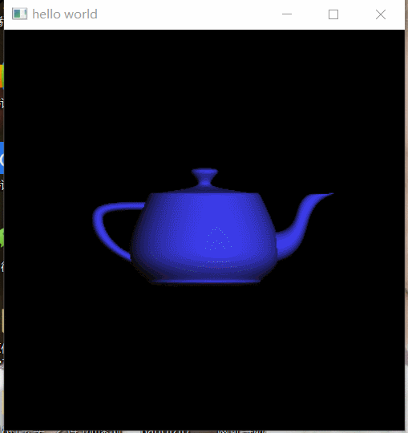
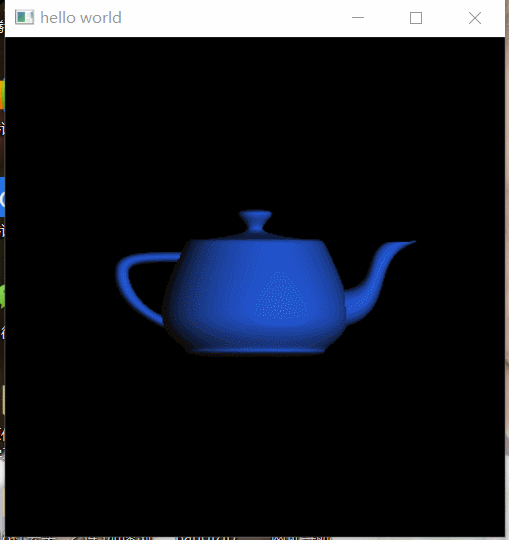
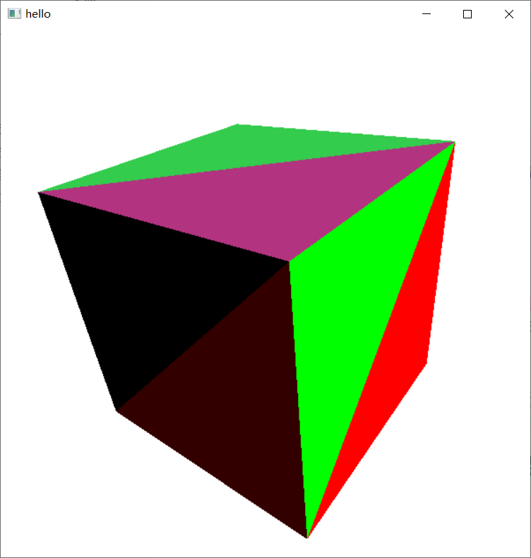
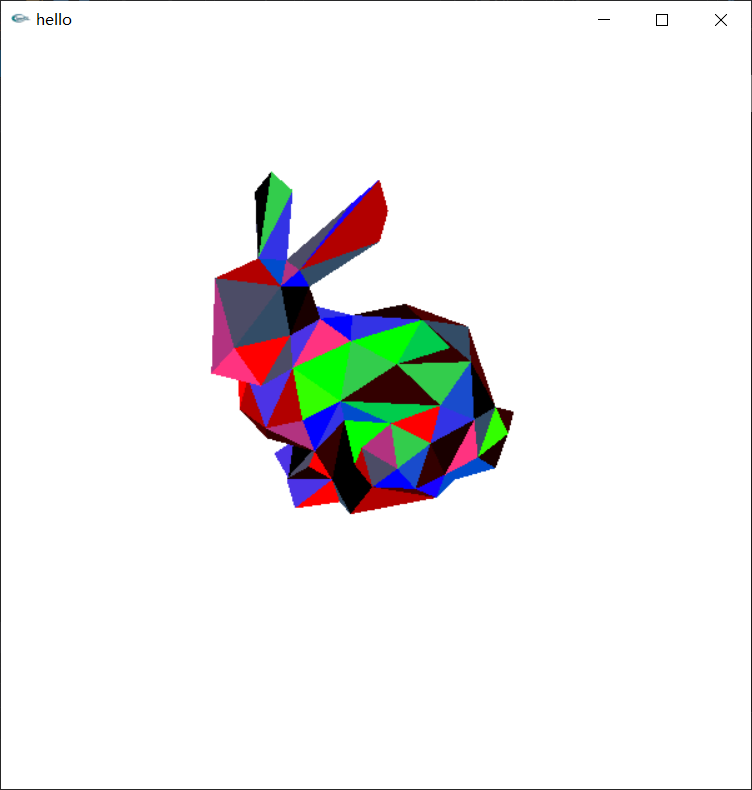
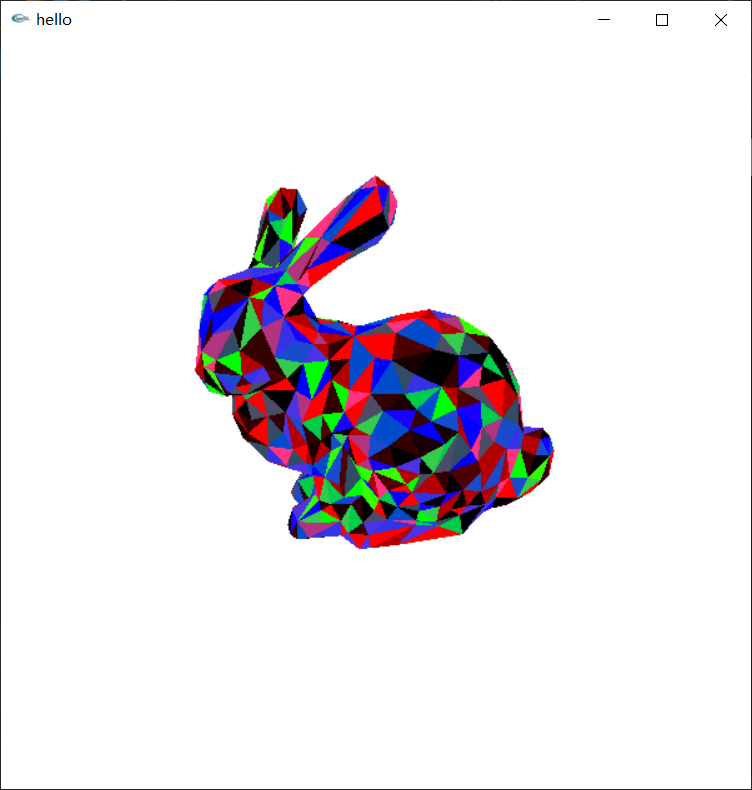
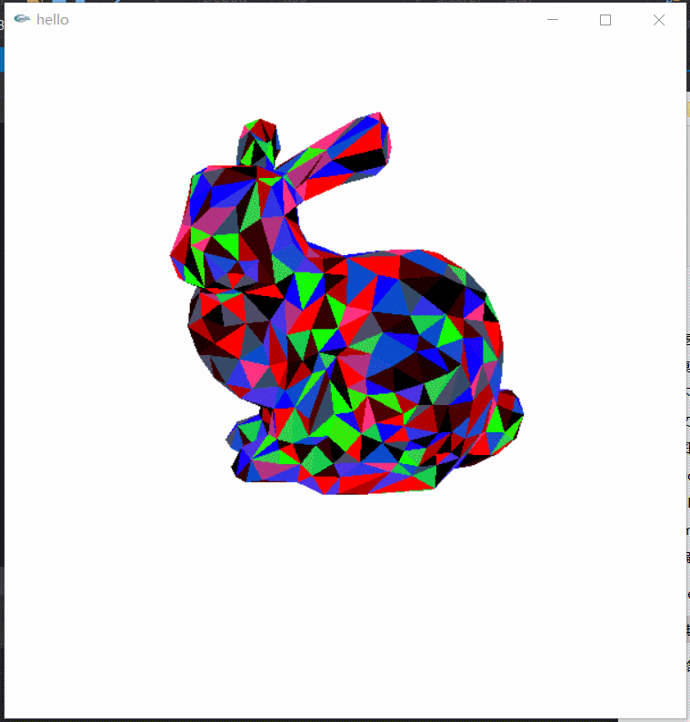

# 编程作业0
---
## 1 茶壶部分
### 1.1 演示

改变颜色

改变光源位置

自动旋转模型

### 1.2 实现
#### 1.2.1 改变颜色

用全局变量*colorMat*定义茶壶的颜色，添加*glutKeyboardFunc*函数，当按下c建时，改变*colorMat*即可。

> 光滑渐变改变颜色的实现：*colorMat*改变到目标值时，不直接改变，而是慢慢过渡到目标值，每次增加/减少0.01即可。

#### 1.2.2 改变光源位置

全局变量*position*定义光源位置，添加*glutSpecialFunc*函数监听，使用箭头键改变光源的位置. 具体来说，左/右箭头键将增/减*position*的X值0.5, 上/下箭头改变*position*的Y值。

#### 1.2.3 按下r自动旋转

在*glutKeyboardFunc*上在添加一个对r的监听，添加*glutTimerFunc*设置一个定时器，*isRotate* 为真时调用*glRotatef*旋转，按下r键时设置：*isRotate = !isRotate;* 就可以做到按下r键控制旋转开始/停止。

## 2 格网装入和显示部分

### 2.1 演示

装入cube.obj

装入bunny_200.obj

装入bunny_1k.obj

基于mouse的相机控制

### 2.2 实现

#### 2.2.1 格网装入和显示

按照作业中的要求提示实现即可。

#### 2.2.2 基于mouse的相机控制

使用*glutMouseFunc*和*glutMotionFunc*分别监听鼠标的按下与移动，左键控制视角，右键移动，滚轮控制大小。

# 3 问题

是否与其他同学合作? 如果是，请让我们知道你和谁交谈，以及你受到他们的什么帮助或者给予了别人什么帮助。

> 未与其他同学合作。

你是否找到一些对完成该作业特别有用的参考资料(书, 文章, 网站等)，如果有请列出清单。

> [介绍了如何使用mouse相机控制](https://blog.csdn.net/xie_zi/article/details/1925778)
> [配置VS2017+glut](https://blog.csdn.net/qq_29698809/article/details/75200562)

所提交的程序有已知BUG吗? 如果有，请列出清单,并尽可能描述产生的原因，及如果有时间你如何修正他们。*这对我们评价你的工作，给你部分分值是非常重要的。*

>自动旋转和鼠标的滚轮不能同时起作用，自动旋转只在*glutdlls37beta.zip*有用，滚轮只在*glutnew.zip*下有用，应该是库的原因。

你是否做了附加分的作业? 如果是，请告诉我们如何使用程序的这些附加特性。如果涉及到许多工作，请描述是如何实现的。

> 1. 按下r键后，自动旋转模型。(参考`glutTimerFunc`).
> 2. 修改代码，当按下`c键` 时，颜色从当前色光滑渐变到目标色(而不直接切换成目标色).
> 3. 实现基于mouse的相机控制，让用户旋转和缩放目标。附加分的多少依赖于实现的质量。
> 实现已经在上面描述。

希望你对本作业给出一些意见和建议? 如，作业是否太长?太难? 需求不清楚? 作业有意思吧, 或者你恨死它了? 你学到些什么吗，或者这完全是浪费时间? 请完全诚实的说出你的心里话，老师绝对认为你是在帮助他和帮助课程。

> 建议：给出确切可用的库
