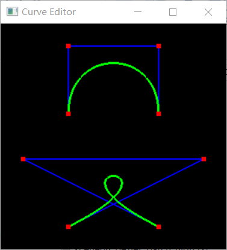
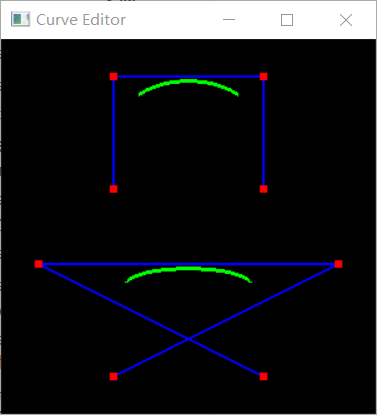

#### 第一步 建工程

1. 新建一个工程，讲所给的一些文件导入到工程中；

2. 按照给出的要新建的类的继承关系，新建七个类；

3. 为新建的类加上必要的函数（实现中暂不写内容）；具体包括

   ```c++
   //Spline.h
           // 用于画图的FOR VISUALIZATION
           virtual void Spline::Paint(ArgParser *args);
           // 用于实现样条类型转换的FOR CONVERTING BETWEEN SPLINE TYPES
           virtual void Spline::OutputBezier(FILE *file);
           virtual void Spline::OutputBSpline(FILE *file);
           // 用于得到控制点的FOR CONTROL POINT PICKING
           virtual int Spline::getNumVertices();
           virtual Vec3f Spline::getVertex(int i);
           // 用于编辑操作的FOR EDITING OPERATIONS
           virtual void Spline::moveControlPoint(int selectedPoint, float x, float y);
           virtual void Spline::addControlPoint(int selectedPoint, float x, float y);
           virtual void Spline::deleteControlPoint(int selectedPoint);
           // 用于产生三角形的FOR GENERATING TRIANGLES
           virtual TriangleMesh* Spline::OutputTriangles(ArgParser *args);
   //Curve.h
           Curve(int num_vertices);
           void set(int i,Vec3f v);
   //BezierCurve.h
           BezierCure(int num_vertices);
   //BSplineCurve.h
           BSplineCurve(int num_vertices);
   //BezierPatch.h
           void set(int i,Vec3f v);
   //SurfaceOfRevolution.h
           SurfaceOfRevolution(Curve *c);
   ```
   
   就可以运行了；

#### 第二步 为`Curve` 类实现`Paint(ArgParser*)`函数

1. 首先要得到控制点，观察框架可知，set函数用于添加控制点，首先实现set函数，我的做法是在Curve类新建一个`vertices(map<int,Vec3f>)`用于存取控制点，set函数：

   ```c++
   void Curve::set(int i, Vec3f v) {
   	vertices->insert(map<int,Vec3f>::value_type(i,v));
   }
   ```

2. 然后考虑到Paint函数既要画Bezier也要画BSpline，所以在画的时候要判断是哪个子类在调用这个函数，我的方法是在Curve类中新增成员flag标记子类，在子类被创建时给出不同的标记，`0->bezier 1->BSpline`，然后在画的时候就可以直接判断了；

3. 在这一步只考虑四个控制点的情形，所以只需取出控制点按照公式画即可，在这里我新建了两个个函数`void bezierXYZ(float t,float *xyz)`和`void bSplineXYZ(float t, float *xyz)`用于计算不同t值时点的坐标；

4. 然后按照`1.0/curve_tessellationd`的步长让t从0递增到1作为曲线的经过点画线即可。

   

   

#### 第三步 实现Bezier曲线和BSplines曲线之间的转换

1. 分别为`BezierCurve`和`BSplineCurve`两个类实现`OutputBezier(FILE *file)` 和 `OutputBSpline(FILE *file)` 函数；

2. `BezierCurve`中的`OutputBezier(FILE *file)`和`BSplineCurve`中的 `OutputBSpline(FILE *file)` 都是将原有信息直接按照格式输出到文件中即可；

3. `BezierCurve`中的`OutputBSpline(FILE *file)`和`BSplineCurve`中的`OutputBezier(FILE *file)`需要转换再写入；`BezierCurve`中的`OutputBSpline(FILE *file)`：按照公式算出
   $$
   Matrix_{BSpline}=Matrix_{Bezier}*
   \left[
   \begin{matrix}
   6&0&0&0\\
   -7&2&-1&2\\
   2&-1&2&-7\\
   0&0&0&6
   \end{matrix}
   \right]
   $$
   类似的有：
   $$
   Matrix_{Bezier}=Matrix_{BSpline}*
   \left[
   \begin{matrix}
   1/6 & 0 & 0 & 0\\
   2/3 & 2/3 & 1/3 & 1/6\\
   1/6 & 1/3 & 2/3 & 2/3\\
   0 & 0 & 0 & 1/6
   \end{matrix}
   \right]
   $$
   计算完成后再按照格式写入文件中即可。
   
   
   
   
   
   
   
   

#### 第四步 Bezier 和 BSpline 曲线一般化

1. 先重写了一下第二步的两个函数`void bezierXYZ(float t,float *xyz)`和`void bSplineXYZ(float t, float *xyz)`，新加一个参数index，用以计算由index开始的四个控制点的曲线上的点的坐标值，然后新增两个函数`void paintBezier(int index,int curve_tessellation);`和`void paintBSpline(int index,int curve_tessellation)`用来画一段曲线（由画4个控制点曲线改写一下即可）；

2. 然后就是调用`paintBezier`和`paintBSpline`了，需要确定每段的起始点，Bezier为3*i(i=0->(num-1)/3-1)，BSpline为i(i=0->num-4)。

   

   

   

#### 第五步 实现控制点编辑函数

1. 发现前面把vertices放在Curve中好像不太正确，所以改写到了Spline中，然后修改了部分函数；

2. 写好了，但是好像不起作用，先写下一个；

3. 找到了问题，是没有更新map的value，C++的map插入不会覆盖掉原来的值，所以我选择先删除掉再插入；

   

#### 第六步 实现SurfaceOfRevolution类

1. 其实就是实现旋转曲面，由曲线旋转得到曲面；

2. 在这里我把一些在curve当中写的函数移动到了基类spline中，便于使用；

3. 先研究TriangleMesh类知，提供了由曲线旋转得到曲面的功能，我们可以只需要设置点，再把点连起来即可；

4. 首先是Bezier曲线旋转得到的曲面，bezier曲线的控制点为3*num_line+1，其实是由num_line条bezier曲线组合而成，由给出的参数curve-tessellation知一整条线有num_line*(args->curve_tessellation)+1个点，所以旋转之后共有(num_line*(args->curve_tessellation)+1)*args->revolution_tessellation个点，算出这些点的坐标，完成set工作，然后要设置形成面的点的下标，这里参考TriangleNet中的写法，每次取出四个点（相邻行的相邻列的点），形成两个面，设置即可；坐标算法：
   $$
   \begin{cases}
   x_Ө=x_t*cos(Ө)\\
   y_Ө=y_t\\
   z_Ө=x_t*sin(Ө)
   \end{cases}
   $$
   
5. BSpline类似，只需更改一些参数；

   > 给出的光线追踪软件由于“找不到入口点无法使用（我的库问题？？）但是win10自带一个3d查看器也可以看所以obj文件均用3d查看器打开。


#### 第七步 实现16个控制点的4x4 Bezier块

1. 这个看起来很难，其实看懂了很简单；生成的面其实就是关于u，v的一个函数：
   $$
   s(u,v)=Bezier(\\
   \qquad \qquad \qquad \qquad \qquad \qquad \qquad Bezier(P_{00},P_{01},P_{02},P_{03},u),\\
   \qquad \qquad \qquad \qquad \qquad \qquad \qquad Bezier(P_{10},P_{11},P_{12},P_{13},u),\\
   \qquad \qquad \qquad \qquad \qquad \qquad \qquad Bezier(P_{20},P_{21},P_{22},P_{23},u),\\
   \qquad \qquad \qquad \qquad \qquad \qquad \qquad Bezier(P_{30},P_{31},P_{32},P_{33},u),\\
   \qquad v\\
   )
   $$

2. 我们只需要new一个TriangleNet，这个类中连面都给我设置好了，我们只需要设置点，也很简单，双层循环u，v算出的`s(u,v)`即为所求点；

3. 其他的一些函数参考之前的类实现。

   

   

   

   

### TeaPot部分


#### 附加分的实现 >4个控制点的曲线转换

> 一种比较投机取巧的写法，但是需要修改源文件，其他方法暂未想到。

想法就是把>4个控制点的曲线看成是多段4个控制点的曲线，然后对每段曲线进行转换，给出的文件里面直接写入了num_splines，所以我们要对其进行修改，测试时未修改给出文件，而是手动修改obj文件。


*<u>用新版的glut库就可以用老师提供的软件了，在这里就不再做演示了（怕麻烦。。。）</u>*