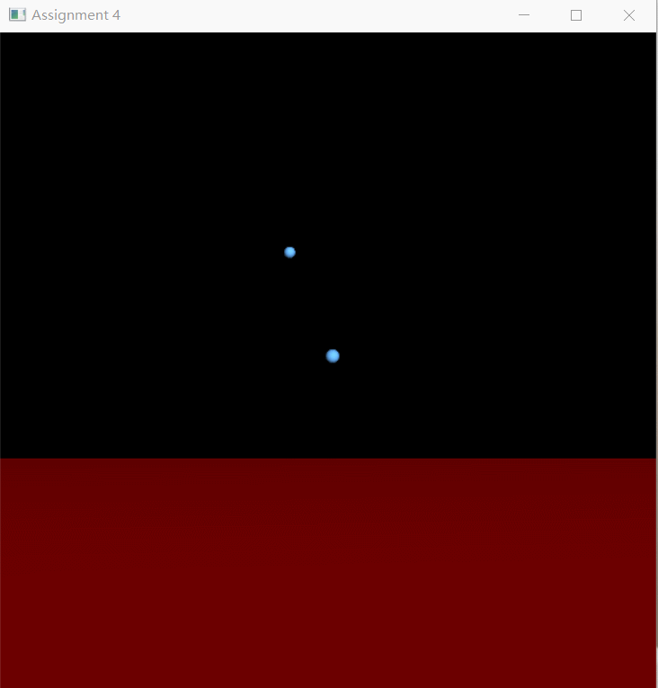
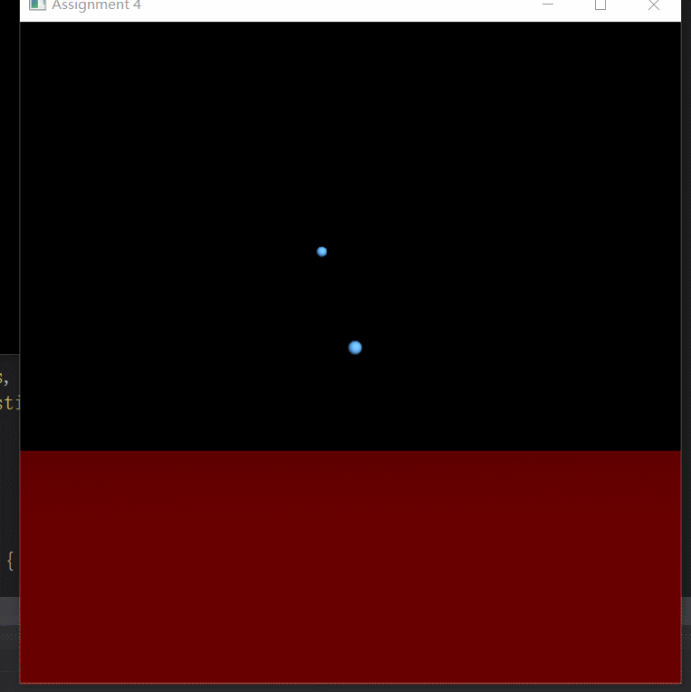
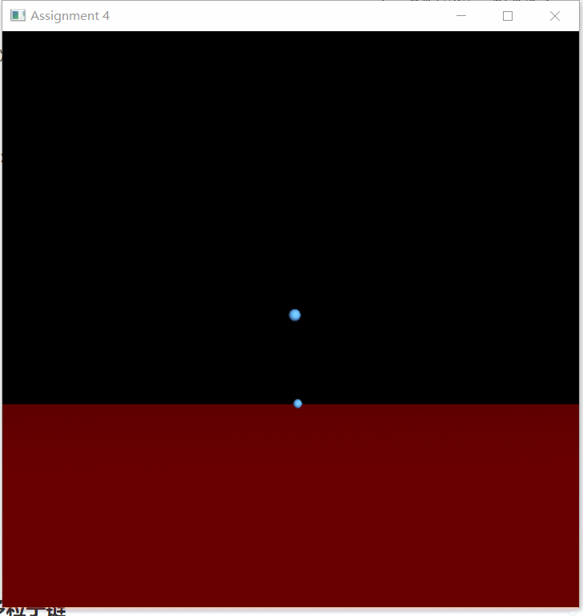
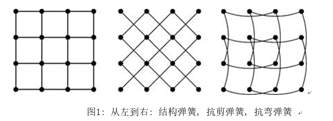
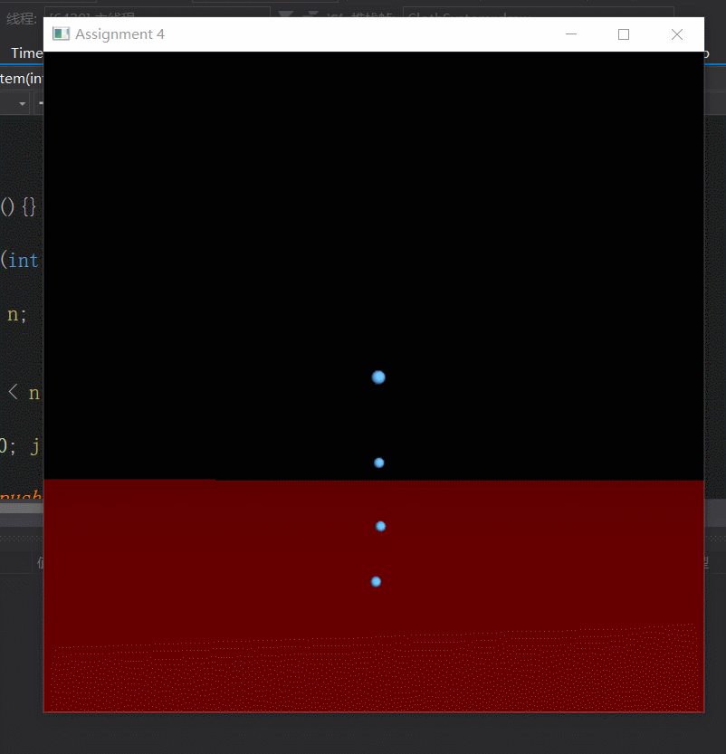

> 姓名：徐鸿飞
>
> 学号：20171002608
>
> 班级：111172

### 一、 运行程序

直接使用VS2017打开工程，首先报错：

> LNK2038	检测到“_MSC_VER”的不匹配项: 值“1600”不匹配值“1900”(camera.obj 中)	a3	H:\XHF\课件\计算机图形学\实习三\distrib\RK4.lib(integrator.obj)

查询可知是版本的原因，去掉RK4.lib这个链接库之后（暂时不知道后面是否需要用到），再在`TimeStepper.cpp`中写一下`RK4::takeStep(ParticleSystem* particleSystem, float stepSize)`的实现，即可运行程序。

### 二、解析参数与捕获t

#### 2.1 解析参数

第一个是一个字符（e,t,r),选择求解器（Euler法，梯形法或RK4）。第二个是可选的求解器步长。在`initSystem`  中实现，使用不同的方法即new不同TimeStepper的子类即可，对于求解器步长，在`stepSystem`中将h全局化，然后再初始化。

#### 2.2 捕获t

在`keyboardFunc`中添加对t的捕获，切换不同的系统与求解器类似，new不同ParticleSystem的子类即可。

### 三、实现欧拉法和梯形法的更新器

#### 3.1 欧拉法

根据公式：$X(t+h)=X+h*f(X,t)$ 可以很简单的实现欧拉法，f即evalF，每个系统有不同的实现，暂时不用管。

#### 3.2 梯形法

同样的根据公式：
$$
f_0=f(X,t) \\
f_1 =f(X + hf_0,t + h)\\
X(t + h)=X +(f_0 + f_1) h/2\\
$$

即试探法，先计算走出下一步的倒数值，再回退用当前倒数值与下一步倒数值做平均。

#### 3.3 简单例子

对simpleSystem进行简单的实现，首先:构造函数中只有一个粒子，新加入一个例子，evalF的计算根据$X_t=\left(\begin{matrix}x\\y\\z\end{matrix}\right)$可以很容易实现。到这里就可以看到结果了：



### 四、物理仿真  

#### 4.1 简单单摆

主要就是实现`evalF`，也就是计算$\cfrac{d}{dt}X=f(X,t)=\left(\matrix{v\\F(x,v)}\right)$,对于每个点来说，第一行即是速度，直接赋值即可，第二行应为合力/质量，合力为三个力相加：

重力：$F_{gravity}=mass*g=\left(\matrix{0\\-g*m\\0}\right)$ ;

粘性阻尼力：$F_{resistance}=-k*v$ ;

比较麻烦的是弹簧弹力：$F_{elasticity}=-k(||d||-r)\cfrac{d}{||d||}=\left(\matrix{\cfrac{-k*(||d||-r)*x}{||d||}\\\cfrac{-k*(||d||-r)*y}{||d||}\\0}\right)$ ;

然后有: $F(x,v)=\cfrac{F_{gravity}+F_{resistance}+F_{elasticity}}{mass}$。



#### 4.2 多粒子链

多粒子的情况与单粒子类似，只需要多考虑一个弹簧的弹力即可，每次计算下一个粒子的弹力，然后减去这个弹力，即$F(x,v)=\cfrac{F_{gravity}+F_{resistance}+F_{elasticity}-F_{elasticity\_next}}{mass}$。



### 五、粒子布料系统

- 首先是粒子的**初始**情况，我这里根据行列直接：

  ```c++
  m_vVecState.push_back(Vector3f((float)i*r, 0, (float)j * r));
  m_vVecState.push_back(Vector3f::ZERO);
  ```

  初始手里为0

- 然后是**计算f**；与多粒子链的情况类似，只是布料系统所受到的力更多，每个粒子受到上/下/左/右相邻的粒子的结构弹簧力，左上/左下/右上/右下的粒子抗剪弹簧力，上/下/左/右相隔一个粒子的粒子的抗弯弹簧力：



​	因为这里是从z方向上掉，所以z方向也会有弹簧力的作用，即：
$$
F_{elasticity}=-k(||d||-r)\cfrac{d}{||d||}=\left(\matrix{\cfrac{-k*(||d||-r)*x}{||d||}\\\cfrac{-k*(||d||-r)*y}{||d||}\\\cfrac{-k*(||d||-r)*z}{||d||}}\right)
$$
​	这里需要注意的是一些特殊粒子的情况，不是所有的粒子都受到所有的力。大致分为两类：

> 左上/右上的粒子固定，受合力为0；
>
> 边缘粒子周围粒子可能少一些。

- **画布**，这里参考实习一中的`TriangleNet`方法将步分成许多的三角形，然后设置normal画出来即可。
- 这里有三种弹簧，**参数**比较多，我尝试了较多的参数，比较好的是：

```c++
    int n=15;//一行粒子数
    float r=0.1f;//粒子间间距
    float mass=0.025f;//粒子质量
	float k_resistance = 2.0f;//阻尼系数
	float k_structural = 20.f;//结构弹簧弹性系数
	float k_shear = 10.f;//抗剪弹簧弹性系数
	float k_flex = 200.f;//抗弯弹簧弹性系数
	float g=9.8f;//重力系数
```



### 六、回答问题

1. 如何编译和运行代码？如果你的可执行文件需要某些参数才能正常工作，请确保这些参数被指定。

   > 直接运行release下的可执行文件，可选参数：
   >
   > - 第一个是一个字符（e,t,r),选择求解器（Euler法，梯形法或RK4）。
   > - 第二个是可选的求解器步长。  

2. 和班上的谁合作过吗？如果是，请说明和谁交谈，以及你给予或接受了什么样的帮助。

   > 

3. 有什么参考文献 (书, 文章, 网站等)你觉得对你完成作业特别有帮助，请列出来。 

   > - [初值问题](https://zh.wikipedia.org/wiki/%E5%88%9D%E5%80%BC%E5%95%8F%E9%A1%8C)
   >
   > - [[error LNK2038: mismatch detected for '_MSC_VER': value '1600' doesn't match value '1700' in CppFile1.obj](https://stackoverflow.com/questions/19575747/error-lnk2038-mismatch-detected-for-msc-ver-value-1600-doesnt-match-valu)](https://stackoverflow.com/questions/19575747/error-lnk2038-mismatch-detected-for-msc-ver-value-1600-doesnt-match-valu/19575855#19575855)
   >
   > - [龙格－库塔法](https://zh.wikipedia.org/wiki/%E9%BE%99%E6%A0%BC%EF%BC%8D%E5%BA%93%E5%A1%94%E6%B3%95)

4. 你的代码有些什么已知问题? 这很重要，如果你帮助我们理解发生了些什么，会给你加分 

   > 参数的值可能过大，当积分步长稍微大一点的时候，布料系统就会很不稳定。

5. 实现了什么附加分吗? 如果是, 告诉我们如何使用你设计的附加特性。如果涉及较多工作，请描述你是如何做的。 

   > -  除了用线框网格来显示布料，实现光滑渲染。此部分最具挑战是在每个结点定义法向，这需要使用邻近粒子的位置来进行近似。  见粒子布料系统部分。
   >
   > -  实现4阶Runge-Kutta积分器 ：
   >
   >   令初值问题表述如下。
   >   $$
   >   y'=f(t,y),\quad y(t_{0})=y_{0}
   >   $$
   >   则，对于该问题的RK4由如下方程给出：
   >   $$
   >   y_{{n+1}}=y_{n}+{h \over 6}(k_{1}+2k_{2}+2k_{3}+k_{4})
   >   $$
   >   其中
   >   $$
   >   k_{1}=f\left(t_{n},y_{n}\right)\\
   >   k_{2}=f\left(t_{n}+{h \over 2},y_{n}+{h \over 2}k_{1}\right)\\
   >   k_{3}=f\left(t_{n}+{h \over 2},y_{n}+{h \over 2}k_{2}\right)\\
   >   k_{4}=f\left(t_{n}+h,y_{n}+hk_{3}\right)
   >   $$
   >   

6. 对本作业有些什么可分享的建议和意见? 

   > 希望尽量提供比较新版本的作业。