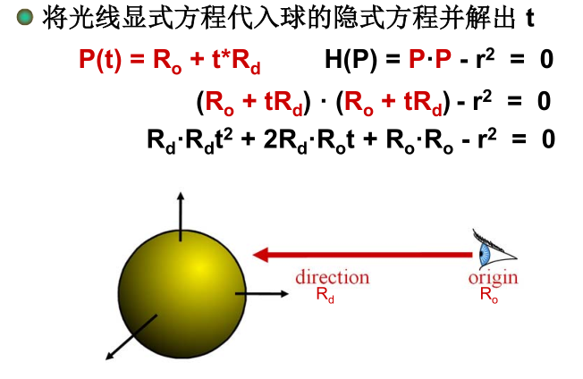

> 姓名：徐鸿飞
>
> 学号：20171002608
>
> 班级：111172

### 1、建立工程

首先用vs新建一个Windows控制台文件，再将需要的文件导入。

然后明确需要我们编写的内容：

> - 一个纯虚类 Objects3D
> - Object3D的子类 Sphere 和 Group
> - 纯虚类 Camera
> - Camera 的子类 OrthographicCamera
> - 主函数

### 2、Object3D及其子类

##### 2.1 Object3D

直接按照作业文件中所述的那样添加函数及成员变量即可，无需实现函数。

##### 2.2 Sphere

主要是要实现`intersect`函数，此函数用于光线和球求交点，根据

即可很容易的求出t，再根据情况更新Hit即可。（需要考虑球心不在原点的情况，直接改变光线原点的位置即可，因为我们求的t值是一个相对值）

有交点返回true，没有就false。

##### 2.3 Group

此类存储所有的Object3D及其子类，直接用数组存储，`addObject`也很容易实现，然后是这个类的`intersect`函数，直接循环调用数组中Object3D的`intersect`函数，只要其中一个有交点就返回true。

刚开始写的`res=res||object->intersect()`总是不对，之后才发现这个代码被优化之后res为true时后面的函数就不会被执行了。。。

### 3、 Camera及其子类

##### 3.1 Camera

直接按照文件所述实现即可

##### 3.2 OrthographicCamera

需要实现的是一个正交相机，主要是此类的初始化与产生光线函数，对于初始化：输入图像中心, 方向向量, 向上向量（up vector）, 和图像大小，其中图像中心和大小直接赋值即可，需要算的是根据方向向量和向上向量算出类中的三个正交基：因为向上向量可能与方向向量不垂直，需要先将其垂直：先求出方向向量和向上向量所在平面的法向量，再求出方向向量和这个法向量所在平面的法向量即为和方向向量垂直的向上向量，而上一个法向量即为水平向量，最后将他们都单位化即可。

对于产生光线函数，主要是计算光线的origin，根据文件中：给出变化范围为`(0,0) -> (1,1)`, 其规律为：

```
center - (size*up)/2 - (size*horizontal)/2  ->  center + (size*up)/2 + (size*horizontal)/2
```

所以origin为：

```c++
m_center + (point.x() - 0.5f)*m_size*m_horizontal + (point.y() - 0.5f)*m_size*m_up
```

### 4、 main

> 其功能包括读入场景(使用所提供的分析parsing代码), 对图像平面的每个象素循环, 使用你的`OrthographicCamera` 类产生光线, 与高层的`Group`类求交，在该类中存储了场景的对象, 并将最近交点的颜色写到图像文件中。

直接使用给出的parse_code代码读取命令行参数；

主要是双层循环产生光线与Group（即所有的Object3D）求交点，若有则写入图像颜色。

写入depth信息类似。

> 写入depth信息时，要做相应的处理。因为image写入的颜色值需为0-1，所以要将depth值对应到0-1；再然后应该是越白表示约进，所以最后要depth=1-depth