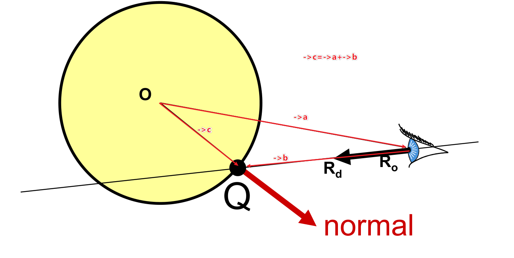
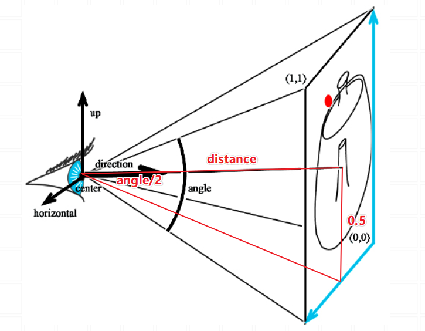
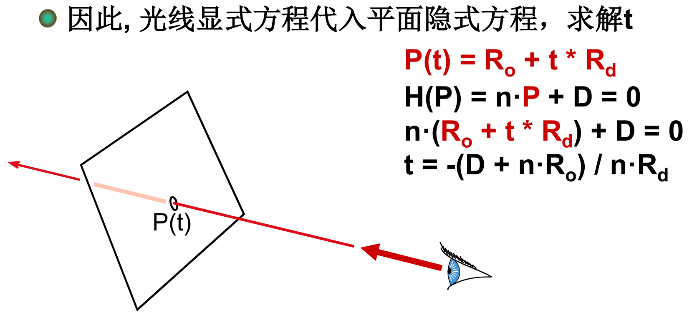
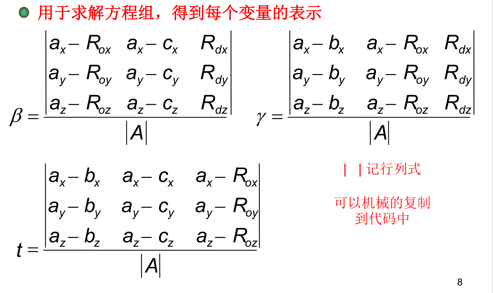
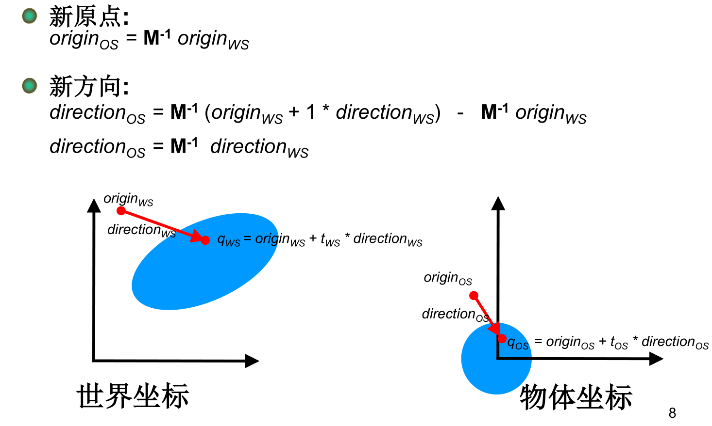

> 姓名：徐鸿飞
>
> 学号：20171002608
>
> 班级：111172

### 1、建立工程

第一步建立工程，将32的文件和本次新的文件导入到工程中。

### 2、修改32的文件

首先是球的线面求交，要求出法向量：

所以：`Vec3f normal = ray_origin + t2 * r.getDirection();`

添加parse的代码。

### 3、实现PerspectiveCamera

构造函数与`OrthographicCamera`类类似，将size改为angle即可。

然后是产生光线的函数，OrthographicCamera主要是计算原点，而PerspectiveCamera主要是计算方向：

所以要计算方向先要计算距离。

`tan(angle/2)=0.5/distance`,所以`distance=0.5/tan(angle/2)`；

由32知对于getmin直接返回0

### 4、实现Plane与Triangle

##### 4.1 Plane

构造函数直接赋值，主要是求交函数：

当光与平面平行时没有交点。

##### 4.2 Triangle

同样的构造函数直接赋值。然后是求交函数：

### 5、Transform类

刚开始没有看懂这个类是做什么的。然后知道就是实现光线追踪中的转换。把光线从世界空间转到物体空间：

主要就是重新计算法向量。

先判断转换后的光线与物体是否相交，如果相交，再用转换矩阵转换法向量。

Matrix提供很好用的转换函数。

### 6、Main函数

duoxie与32类似，只是原来是直接写入物体的颜色，本次要根据光源计算出颜色再写入，同时要多写一个法向量的文件。