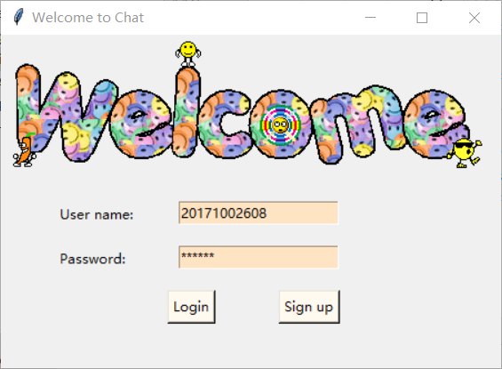
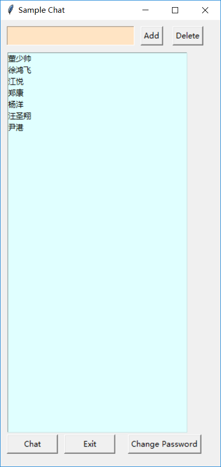
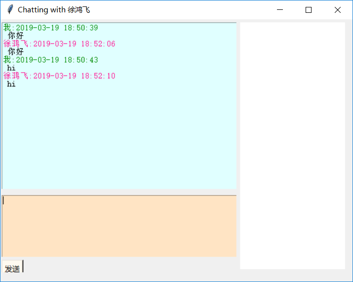

# 姓名： 徐鸿飞

# 详细设计过程

我的设计顺序是：

## 与服务器通信的UDP

首先在类初始化时，绑定要联系的服务端地址，在类对象被销毁时，关闭被创建的套接字。其他函数（修改密码、注册（未实现）、登陆、向单个好友发送消息、接受单个好友消息、接受所有好友消息（未使用）、离线）按照通信协议直接编写。

## 登陆界面的编写

Login是整个程序的入口，利用tkinter创建界面，提供登陆与注册功能。在此段代码中，new一个UDP的对象，在登陆时调用udp的方法，并在登陆成功后传递给Main类。

## 主界面类Main

程序的主窗口，提供添加与删除好友功能。添加与删除好友功能利用读取文件的方式，所以无法同步至服务器，只能在本地进行。
> 因为用文件存储了所有软工同学的信息，所以可以直接输入好友名字添加好友并聊天。

好友列表显示采用tkinter的Listbox显示，选择一个好友按chat按钮开始聊天,创建一个新的Chat类的对象。
在类初始化时创建一个新的套接字作为本地服务器来与各个子窗口联系。
类中的pro_mess函数处理来自各个聊天子窗口的消息，先接受子窗口的消息，判断消息类型，然后通过传入的udp与服务器端联系，并将服务器端返回的消息发送回子窗口，pro_mess函数通过一个新的线程来运行。

## 聊天窗口chat

与好友聊天的子窗口，在本类中采用一套类似于与服务器端联系的协议与主窗口联系。窗口的布局直接采用了老师提供的参考代码，但是封装了一下。

# 遇到的问题

## bug1
> 关闭套接字总发送在该线程关闭后。所以会导致“OSError: [WinError 10038] 在一个非套接字上尝试了一个操作。”同时也会引起一系列的关于threading的错误。
在网上查找了直接关闭一个线程的办法，利用ctypes和inspect实现。

## bug2
> chat与主窗口通讯混乱
发送消息时接受消息与新的线程里接受好友消息混乱，后来加了一些控制条件。

## bug3
> Chat类中多线程中的函数无法访问类成员
发现问题时在trans之前开启了线程 所以没有找到类成员name

# 帮助
## 杀死一个线程
参考了[如何杀死一个python的线程](https://blog.csdn.net/vinsuan1993/article/details/78158589)
## 界面布局
参考了[tkinter 窗口可视化](https://www.youtube.com/playlist?list=PLXO45tsB95cJU56K4EtkG0YNGBZCuDwAH)