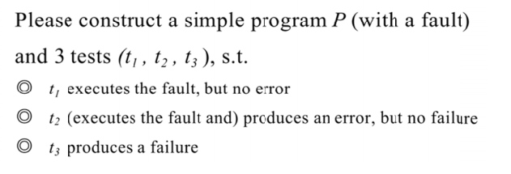
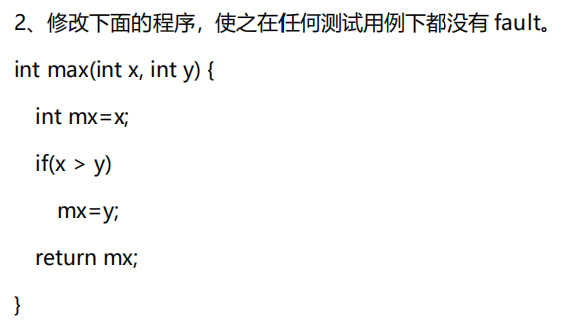

### <center>PIE课后作业</center>

> 姓名：徐鸿飞	班级：111172	学号：20171002608

#### Question：

1. 
2. 

#### Solution:

```java
public class PIE {
    //1.
    /**
     * 找到数组中第一个目标数的下标,否则返回-1
     * @param nums 数组
     * @param n 目标数
     * @return 第一个目标数的下标
     */
    public int findFirstIndex(int[] nums,int n){
        for (int i = 0; i < nums.length-1; i++) {
            if (nums[i]==n)return n;
        }
        return -1;
    }
    // t1.executes the fault, but no error. ([0,1,2,3],0)
    // t2.(executes the fault and) produces an error, but no failure.   ([0,1,2,3],4)
    // t3.produces a failure.   ([0,1,2,3],3)

    //2.
    public int max(int x,int y){
        int mx=x;
        if (x<y)mx=y;
        return mx;
    }
}
```

