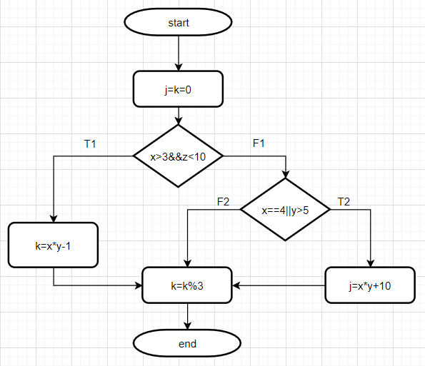
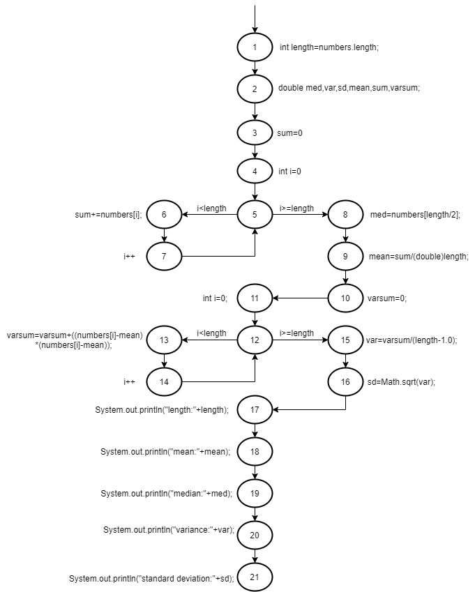

#### 白盒测试课后练习

> 姓名：徐鸿飞	班级：111172	学号：20171002608

##### 1、

给定下面的程序段，要求用白盒测试法对其进行测试。依据**判定覆盖、条件组合覆盖** 2种覆盖标准，请首先绘制**流程图**，然后设计出 **2 组**满足相应覆盖标准的“**最小**”的测试用例集。（共 10 分） 

```c++
void MyFunc(int x, int y, int z, int &j, int k) { 
 j=k=0; 
 if( (x>3) && (z<10)) k=x*y-1; 
 else if ((x==4) || (y>5)) j=x*y+10; 
 k=k%3; 
} 
```
**流程图**：


**判定覆盖**：应执行路径-- T1T2**∧**F1F2或者T1F2**∧**F1T2，用例：

> (1)
>
> > [(4,6,9,0,0),(4,6,9,0,2)]	T1T2
> >
> > [(3,4,10,0,0),(3,4,10,0,0)]	F1F2
>
> (2)
>
> > [(5,4,9,0,0),(5,4,9,0,1)]	T1F2
> >
> > [(4,6,10,0,0),(4,6,10,34,0)]	F1T2

**条件组合覆盖**：满足覆盖情况：

> ①x>3,z<10	②x>3,z>=10
>
> ③x<=3,z<10	④x<=3,z>=10
>
> ⑤x==4,y>5	⑥x==4,y<=5
>
> ⑦x!=4,y>5	⑧x!=4,y<=5

用例：

> (1)
>
> > [(4,6,9,0,0),(4,6,9,0,2)]	①⑤
> >
> > [(4,5,10,0,0),(4,5,10,30,0)]	②⑥
> >
> > [(3,6,9,0,0),(3,6,9,28,0)]	③⑦
> >
> > [(3,5,10,0,0),(3,5,10,0,0)]	④⑧
>
> (2)
>
> > [(4,5,9,0,0),(4,5,9,0,1)]	①⑥
> >
> > [(4,6,10,0,0),(4,6,10,34,0)]	②⑤
> >
> > [(3,5,9,0,0),(3,5,9,0,0)]	③⑧
> >
> > [(3,6,10,0,0),(3,6,10,28,0)]	④⑦

##### 2、

给定下面的程序段，要求用白盒测试法对其进行测试。首先绘制代码对应的**控制流图**，然后分别给出满足下面覆盖标准的“**测试路径**”。
(1)点/边覆盖;
(2) 边对覆盖;
(3)主路径覆盖。

```java
public static void computeStats(int[] numbers){
    int length=numbers.length;
    double med,var,sd,mean,sum,varsum;
    sum=0;
    for (int i = 0; i < length; i++) {
        sum+=numbers[i];
    }
    med=numbers[length/2];
    mean=sum/(double)length;
    varsum=0;
    for (int i = 0; i < length; i++) {
        varsum=varsum+((numbers[i]-mean)*(numbers[i]-mean));
    }
    var=varsum/(length-1.0);
    sd=Math.sqrt(var);
    System.out.println("length:"+length);
    System.out.println("mean:"+mean);
    System.out.println("median:"+med);
    System.out.println("variance:"+var);
    System.out.println("standard deviation:"+sd);
}
```

**流程图**：



(1)点/边覆盖：

> 点覆盖：[1,2,3,4,5,6,7,5,8,9,10,11,12,13,14,12,15,16,17,18,19,20,21]
>
> 边覆盖：[1,2,3,4,5,6,7,5,8,9,10,11,12,13,14,12,15,16,17,18,19,20,21]

(2) 边对覆盖：

> [1,2,3,4,5,6,7,5,6,7,5,8,9,10,11,12,13,14,12,13,14,12,15,16,17,18,19,20,21]
> [1,2,3,4,5,8,9,10,11,12,15,16,17,18,19,20,21]

(3)主路径覆盖：

> 主路径：
> [1,2,3,4,5,6,7]
> [1,2,3,4,5,8,9,10,11,12,13,14]
> [1,2,3,4,5,8,9,10,11,12,15,16,17,18,19,20,21]
> [5,6,7,5]
> [6,7,5,8]
> [6,7,5,6]
> [7,5,6,7]
> [12,13,14,12]
> [13,14,12,15]
> [13,14,12,13]
> [14,12,13,14]
>
> 测试路径：
>
> [1,2,3,4,5,6,7,5,6,7,5,8,9,10,11,12,13,14,12,13,14,12,15,16,17,18,19,20,21]
> [1,2,3,4,5,8,9,10,11,12,15,16,17,18,19,20,21]
> [1,2,3,4,5,8,9,10,11,12,13,14,12,15,16,17,18,19,20,21]