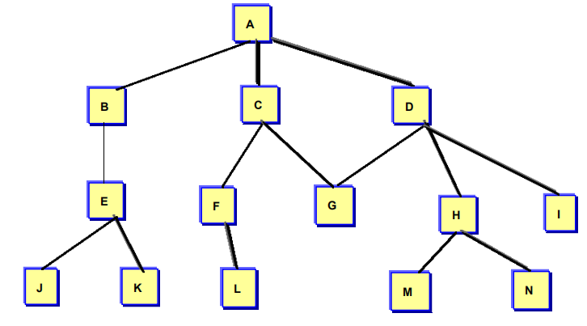

#### 黑盒测试课后练习

> 姓名：徐鸿飞	班级：111172	学号：20171002608

一个系统的模块结构如下图所示，用{×,×,×}表示这个系统的测试模块组合, 例如：{A}{A,B,…}….。请给出“自顶向下”测试（提供**两种遍历方式**）的模块组合。 

宽度优先遍历：

> {A}
>
> {A,B,C,D}
>
> {A,B,C,D,E,F,G,H,I}
>
> {A,B,C,D,E,F,G,H,I,J,K,L,M,N}

深度优先遍历：

> {A,B,E,J}
>
> {A,B,E,J,K}
>
> {A,B,E,J,K,C,F,L}
>
> {A,B,E,J,K,C,F,L,G}
>
> {A,B,E,J,K,C,F,L,G,D,H,M}
>
> {A,B,E,J,K,C,F,L,G,D,H,M,N}
>
> {A,B,E,J,K,C,F,L,G,D,H,M,N,I}